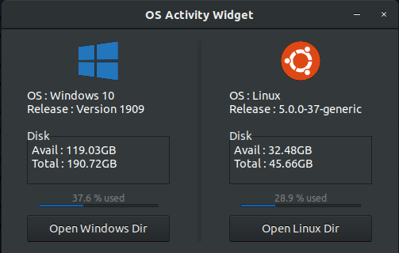

# OS-widget

Displays a simple GUI that shows disk space remaining for a dual-booted/single-booted computer  
  



## Software tools:  
* Visual Studio Code  
* G++ 7.4 Compiler  
* gtkmm (C++ wrapper for gtk)  

## Dependencies:  
**Ubuntu/Debian**:
``` 
apt-get install libgtkmm-3.0-dev  
```
**Fedora**
```
yum install gtkmm30-docs
```

## Compile Instruction:  
```
make
```
  

  
Tutorials / References consulted:  
* [GTK3 Tutorial](https://developer.gnome.org/gtk3/stable/gtk-getting-started.html)  
* [GTKMM Tutorial](https://developer.gnome.org/gtkmm-tutorial/stable/)  
* [GTKMM Multi-Item Widgets](https://developer.gnome.org/gtkmm-tutorial/stable/sec-multi-item-containers.html.en)  
* [Styling GTK+ with CSS](https://thegnomejournal.wordpress.com/2011/03/15/styling-gtk-with-css/)
